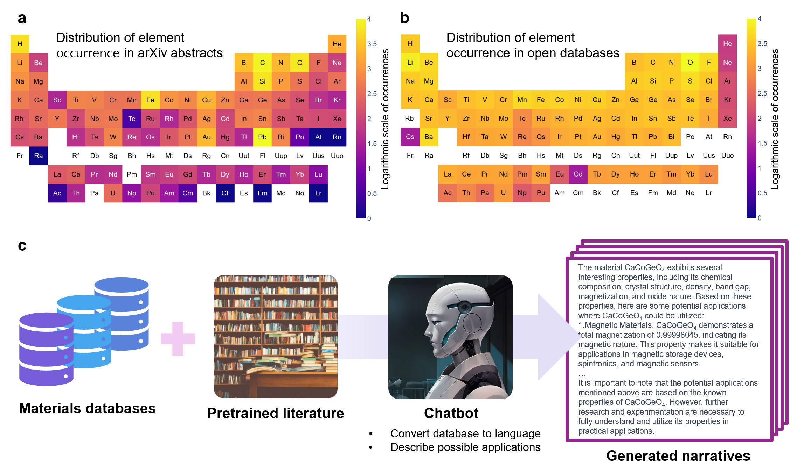

# 1.5 million materials narratives generated by chatbots

Yang Jeong Park $^{1,2,4}$, Sung Eun Jerng $^{3}$, Sungroh Yoon $^{2,*}$, Ju Li $^{1, 4, 5, *}$   
$^1$ Massachusetts Institute of Technology, Department of Nuclear Science and Engineering, Cambridge, 02139, USA   
$^2$ Seoul National University, Department of Electrical and Computer Engineering, Seoul, 08826, Republic of Korea   
$^3$ The University of Suwon, Division of Construction Environment Energy, Suwon, 18323, Republic of Korea   
$^4$ Massachusetts Institute of Technology, Department of Materials Science and Engineering, Cambridge, 02139, USA   
$^5$ Massachusetts Institute of Technology, MIT-IBM Watson AI Lab, Cambridge, 02142, USA

$^*$ corresponding author(s): Sungroh Yoon (sryoon@snu.ac.kr), Ju Li (liju@mit.edu)


## Abstract

The advent of artificial intelligence (AI) has enabled a comprehensive exploration of materials for various applications. However, AI models often prioritize frequently encountered materials in the scientific literature, limiting the selection of suitable candidates based on inherent physical and chemical attributes. To address this imbalance, we generated a dataset consisting of 1,453,493 natural language-material narratives from OQMD, Materials Project, JARVIS, and AFLOW2 databases based on *ab initio* calculation results that are evenly distributed across the periodic table. The generated text narratives were then scored by both human experts and GPT-4, based on three rubrics: technical accuracy, language and structure, and relevance and depth of content, showing similar scores but with human-scored depth of content being the most lagging.  The integration of multimodal data sources and large language models holds immense potential for AI frameworks to aid the exploration and discovery of solid-state materials for specific applications.

# Overview
This is an implementation of synthetic data generation framework for materials science. It uses publicly available *ab initio* databases and ChatGPT to generate narratives describing materials. There is a significant bias in the materials studied and mentioned in the literature (Figure a, b). By utilizing materials from an open database, we can overcome this bias and teach the language model a diverse range of information (Figure c).  



## Installation

Conda enviroment to reproduce our work is provided as follow.
```
conda create -n gpt_narratives python=3.10.13
pip install torch==2.2.1 torchvision==0.17.1 torchaudio==2.2.1 --index-url https://download.pytorch.org/whl/cu118
pip install  dgl -f https://data.dgl.ai/wheels/torch-2.2/cu118/repo.html
pip install joblib wandb matplotlib scikit-learn openai python-dotenv jarvis-tools
```

## Reproducing Generation Code
In this project, we utilized four popular materials databases to generate narratives: OQMD, Materials Project, JARVIS, and AFLOW2.

1. Download Databases: Use jarvis-tools to download databases from JARVIS in HDF format by running:   
```python download_dataframes.py```
2. Train GNN Model: Train a Graph Neural Network (GNN) model to predict unknown property values by running:   
```python train_GNN.py```   
3. Inference: To infer properties using the trained model, execute:   
```python inference_GNN.py```
4. Generate Narratives: Create narratives based on the synthesized data:
First, generate text describing property values:   
```python GPT_text_generation.py```   
Then, identify potential applications:   
```python GPT_explanation_generation.py```
5. Merge Texts: Combine all generated texts into a single file:   
```python merge.py```


# Acknowledgement
- Pytorch implementation of ALIGNN: https://github.com/usnistgov/alignn
